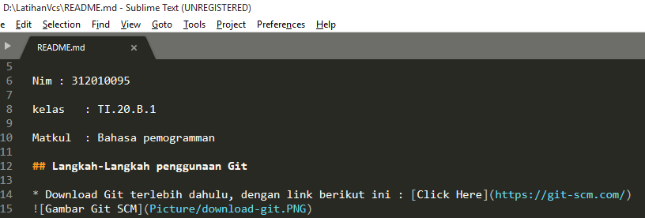

# LatihanVcs
Repository ini dibuat untuk memenuhi tugas pertemuan 4 -Bahasa pemograman

Nama	: Antini permatasari

Nim	: 312010095

kelas	: TI.20.B.1

Matkul	: Bahasa pemogramman

## Langkah-Langkah penggunaan Git

* Download Git terlebih dahulu, dengan link berikut ini : [Click Here](https://git-scm.com/)

* Setelah file terdownload, silahkan instalasi dengan referensi berikut ini : [Git installasi Guide](https://www.petanikode.com/git-install/)

* Setelah installasi selesai lakukan pengecekan pada git, Dengan cara membuka aplikasi Git bush pada Windows. Lalu ketik perintah : *git --version*  

![jika muncul tampilan git version, berarti Git sudah berhasil di install dan bisa digunakan. Langkah pertama, kita harus mengkonfigurasi user name dan email di Git dan langsung lakukan pengecekan user name dan email, dengan mengetik syntax berikut :]
* Setelah installasi git--version selesai lalu klik perintah :(https://github.com/)

* Setelah Git create Repository selesai, lalu buka File Explorer pada sebuah folder, dan klik kanan, pilih *Git Bash Here*

* Setelah klik Git Bash Here selesai, lakukan *clonning* repository dari GitHub ke Lokal dengan cara mengetik perintah berikut pada GitBash
> git clone [url]
contoh : *git clone https://github.com/antini-alt/LatihanVcs.git*

* Setelah proses cloning selesai, silahkan edit file **README.md** sesuai dengan keinginan, seperti contoh dibawah ini :

* Kemudian, lakukan proses upload ke server Github dengan perintah berikut :
> git add .

* Setelah proses add selesai, lakukan commit pada repository tersebut. dengan ketik perintah berikut :
> git commit -m "update README.md"

* Langkah terakhir untuk upload ke GitHub adalah dengan push git, dengan :
> git push

