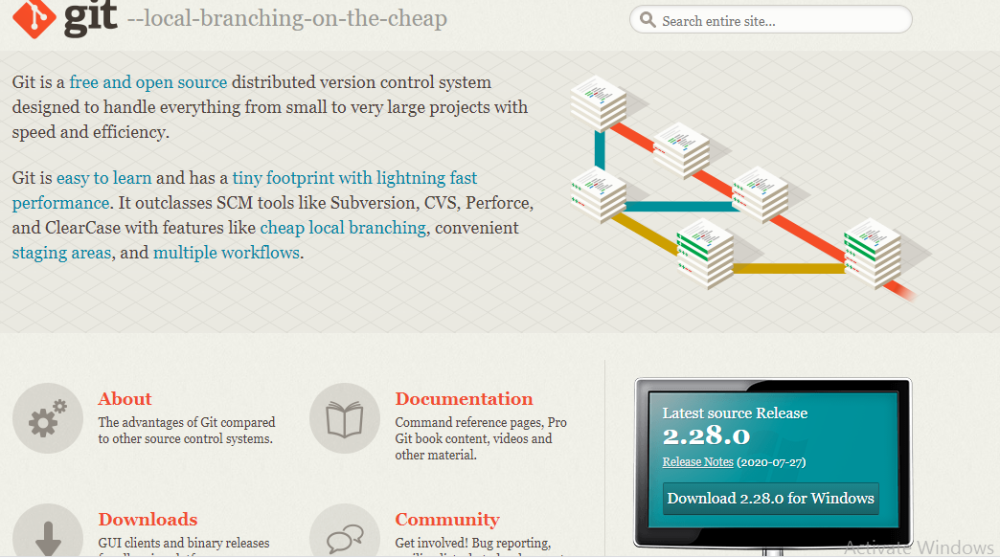

# LatihanVcs
Repository ini dibuat untuk memenuhi tugas pertemuan 4 -Bahasa pemograman

Nama	: Antini permatasari

Nim	: 312010095

kelas	: TI.20.B.1

Matkul	: Bahasa pemogramman

## Langkah-Langkah penggunaan Git

* Download Git terlebih dahulu, dengan link berikut ini : [Click Here](https://git-scm.com/)

* Setelah file terdownload, silahkan instalasi dengan referensi berikut ini : [Git installasi Guide](https://www.petanikode.com/git-install/)

* Setelah installasi selesai lakukan pengecekan pada git, Dengan cara membuka aplikasi Git bush pada Windows. Lalu ketik perintah : *git --version* 

